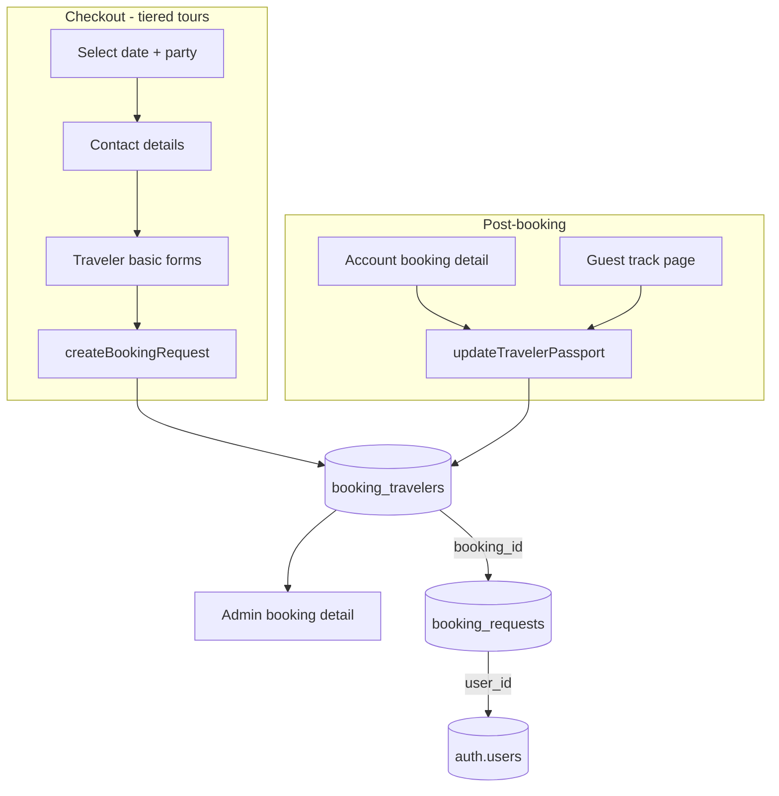

# Per-traveler booking information

## Current state

Bookings store only a **primary contact** (`contact_name`, `contact_email`, `contact_phone`) and an aggregate **headcount** (`travelers`). Party composition for tiered tours lives in `pricing_breakdown` (adults from occupancy tier + child tier counts) but there are no individual traveler records.

Key files today:
- Booking form: [`components/tour/BookingWidget.tsx`](components/tour/BookingWidget.tsx)
- Server action: [`app/actions.ts`](app/actions.ts) → `createBookingRequest`
- Validation: [`lib/schemas.ts`](lib/schemas.ts) → `bookingSchema`
- Pricing/slots: [`lib/pricing.ts`](lib/pricing.ts)

## Scope (per your choices)

| Area | Decision |
|------|----------|
| When to collect | **Checkout:** full name, DOB, gender (required on tiered tours). **Later:** passport number, expiry, nationality |
| Tour types | **Tiered tours only** (`pricing.occupancy.length > 0`). Flat tours keep current single-contact flow |
| Primary contact | Unchanged — booker contact block stays separate from traveler manifest |

## Architecture



## User linking — how travelers connect to accounts

**Travelers are not linked to users directly by default.** Access flows through the parent booking:

```
auth.users  ←──  booking_requests.user_id  ←──  booking_travelers.booking_id
```

The booker (primary contact) owns the whole party. All traveler rows on that booking are readable/editable by whoever owns the booking — not by each traveler individually.

### Scenario A — existing logged-in user books

1. User is authenticated at checkout.
2. `create_booking_with_travelers` sets `booking_requests.user_id = auth.uid()` on insert.
3. All `booking_travelers` rows are inserted with the same `booking_id`.
4. RLS grants access: `select` on `booking_travelers` where `booking_requests.user_id = auth.uid()`.
5. User sees the full manifest immediately in `/account/bookings/[ref]`.

Optional: set `booking_travelers.user_id = auth.uid()` on **position 1 only** (`is_primary = true`) to mark which traveler record represents the account holder (useful for profile pre-fill later). Other travelers in the party keep `user_id = null`.

### Scenario B — guest books, then signs up

Uses the **existing claim flow** — no new traveler-specific claim needed:

1. Guest submits booking → `booking_requests.user_id` is `null`; travelers exist via `booking_id`.
2. Guest tracks booking via `/bookings/track` using reference + `contact_email` (unchanged).
3. Guest creates account or confirms email with the **same email** as `contact_email`.
4. On auth callback, [`claim_guest_bookings()`](supabase/migrations/0012_account_features.sql) runs (already wired in [`app/auth/callback/route.ts`](app/auth/callback/route.ts) and [`ClaimGuestBookingsOnMount`](components/account/ClaimGuestBookingsOnMount.tsx)).
5. RPC sets `booking_requests.user_id = auth.uid()` where `contact_email` matches.
6. All travelers on claimed bookings become visible in the account — inherited through `booking_id`, not per-row linking.

**Extend `claim_guest_bookings` and `claim_booking_by_reference`** to also set `booking_travelers.user_id = auth.uid()` where `position = 1` and `booking_id` was just claimed (marks primary traveler as the account holder).

### Scenario C — guest books, never signs up

- Continues using `/bookings/track?ref=…` with reference + email.
- `update_traveler_passport` RPC authorizes via reference + email match on the parent booking (same pattern as `get_booking_status`).
- No `user_id` is ever set.

### What is NOT in scope

| Case | Behavior |
|------|----------|
| Traveler 2 (e.g. spouse) has their own account | They do **not** get independent account access to the booking. Only the booker (`contact_email`) can manage the party. |
| Separate login per traveler | Would require `booking_travelers.email` + invite/claim flow — deferred to future. |
| Saved passenger profiles across bookings | Would require a `saved_travelers` table on `profiles` — deferred to future. |

### Schema addition for primary-traveler marking

```sql
alter table public.booking_travelers
  add column user_id uuid references auth.users(id) on delete set null,
  add column is_primary boolean not null default false;
```

- `is_primary = true` on position 1 at insert.
- `user_id` set when: (a) logged-in user books, or (b) booking is claimed and position = 1.
- RLS remains **booking-level**; `user_id` on traveler is metadata only, not a separate access path.

## 1. Database — new migration `0013_booking_travelers.sql`

Create a normalized `booking_travelers` table (preferred over JSONB for partial passport updates and admin readability):

```sql
create table public.booking_travelers (
  id                uuid primary key default gen_random_uuid(),
  booking_id        uuid not null references public.booking_requests(id) on delete cascade,
  position          int not null check (position >= 1),
  is_primary        boolean not null default false,  -- true for position 1 (the booker)
  user_id           uuid references auth.users(id) on delete set null,  -- set when booker is logged in or claims booking
  traveler_type     text not null check (traveler_type in ('adult', 'child')),
  child_tier_key    text,  -- from pricing.children[].key when traveler_type = 'child'
  child_tier_label  text,  -- denormalized label for display
  full_name         text not null,
  date_of_birth     date not null,
  gender            text not null check (gender in ('male', 'female', 'unspecified')),
  passport_number   text,
  passport_expiry   date,
  nationality       text,
  created_at        timestamptz not null default now(),
  updated_at        timestamptz not null default now(),
  unique (booking_id, position)
);
```

**Security definer RPCs** (required because guest bookings cannot `select` their own `booking_requests.id` after insert — see comment at line 260 in [`app/actions.ts`](app/actions.ts)):

| Function | Purpose |
|----------|---------|
| `create_booking_with_travelers(...)` | Atomic insert of `booking_requests` + `booking_travelers[]`; returns `id`, `reference_code` for both auth and guest |
| `update_traveler_passport(...)` | Update passport fields for one traveler; authorized via `auth.uid() = booking.user_id` **or** reference + email match (guest track) |
| `get_booking_travelers(p_booking_id)` | Admin/internal helper |

**Extend existing RPCs** to return travelers:
- [`get_own_booking_by_reference`](supabase/migrations/0012_account_features.sql) — add `travelers_detail jsonb` (aggregated manifest)
- [`get_booking_status`](supabase/migrations/0006_booking_enhancements.sql) — same, for guest track page

**RLS:** enable on `booking_travelers`; `select` for booking owner (`user_id = auth.uid()`) and admins; all writes via security definer functions only.

Update [`lib/database.types.ts`](lib/database.types.ts) with `BookingTravelerRow` and RPC signatures.

## 2. Validation layer — [`lib/schemas.ts`](lib/schemas.ts) + new [`lib/travelers.ts`](lib/travelers.ts)

**New schemas:**

```ts
travelerBasicSchema = {
  fullName, dateOfBirth (YYYY-MM-DD), gender ('male' | 'female' | 'unspecified')
}
travelerPassportSchema = {
  passportNumber, passportExpiry, nationality
}
```

**Extend `bookingSchema`** with optional `travelerDetails: travelerBasicSchema[]`.

**New pure helpers in `lib/travelers.ts`:**
- `expandTravelerSlots(pricing, selection)` — maps tiered selection to N slots: adults from `occupancy[occIdx].occupants`, then children expanded per `childCounts` + tier labels/keys (mirrors [`computePeopleCount`](lib/pricing.ts))
- `ageAtTravel(dob, travelDate)` — compute age in years
- `validateTravelerAgeForSlot(slot, dob, travelDate)` — adult slots require age ≥ 12; child slots require age &lt; 18 (simple defaults; infant not in scope for tiered-only)
- `validatePassportExpiry(expiry, travelDate)` — expiry ≥ travel date + 6 months

**Server rules in `createBookingRequest`:**
- If tour has tier pricing: require `travelerDetails.length === computePeopleCount(...)`; validate each slot's age category
- If flat pricing: ignore `travelerDetails` (unchanged behavior)
- Passport fields not accepted at checkout (stripped/ignored)

**New action in [`app/account/actions.ts`](app/account/actions.ts):**
- `updateTravelerPassport({ bookingId \| referenceCode, email?, travelerId, ...passportFields })` — calls `update_traveler_passport` RPC with full validation

## 3. Booking UI — [`components/tour/BookingWidget.tsx`](components/tour/BookingWidget.tsx)

Only when `hasTiers === true`, after party-size fields and before contact details:

- Render one collapsible card per traveler slot from `expandTravelerSlots`
- Label each card: "Adult 1", "Adult 2", "Child (2–11) 1", etc.
- Fields per card: **Full name** (helper text: must match government ID/passport), **Date of birth**, **Gender** (select: Male / Female / Unspecified)
- Pre-fill Traveler 1 name from `contactName` when user types contact name (one-way sync)
- Client `validate()` checks all basic fields before submit
- Submit payload adds `travelerDetails` array aligned to slot order

Extract reusable subcomponent: [`components/tour/TravelerBasicForm.tsx`](components/tour/TravelerBasicForm.tsx) (keeps `BookingWidget` manageable).

Add short notice: *"Passport details can be added after booking from your account or track-booking page."*

## 4. Post-booking passport completion

**New component:** [`components/account/TravelerPassportPanel.tsx`](components/account/TravelerPassportPanel.tsx)
- Lists travelers with completion status (complete / missing passport)
- Per-traveler form: passport number, expiry date, nationality (country `<select>` from new [`lib/countries.ts`](lib/countries.ts) — curated ISO list)
- Disabled when booking is `cancelled` or travel date is in the past
- Shows validation errors (6-month rule, required fields)

**Wire into:**
- [`app/(site)/account/bookings/[ref]/page.tsx`](app/(site)/account/bookings/[ref]/page.tsx) — below `BookingDetailView`
- [`app/(site)/bookings/track/page.tsx`](app/(site)/bookings/track/page.tsx) — after successful lookup (guest path uses reference + email)

**Update [`components/account/BookingDetailView.tsx`](components/account/BookingDetailView.tsx):**
- Replace aggregate "Travelers: N" with a manifest summary when `travelers_detail` is present (name + type per row; mask passport as `•••1234`)

## 5. Admin — [`app/admin/bookings/[id]/page.tsx`](app/admin/bookings/[id]/page.tsx)

Add **Traveler manifest** card:
- Table: position, type/tier label, full name, DOB, gender, passport (full), expiry, nationality
- Badge for incomplete passport records
- Fetch via existing `getAdminBookingById` extended to join `booking_travelers`

## 6. Server action refactor — [`app/actions.ts`](app/actions.ts)

Replace direct `booking_requests` insert with `create_booking_with_travelers` RPC when tiered + travelers present. Keep existing insert path for flat tours.

This also fixes the guest `bookingId` gap — RPC returns `id` for confirmation emails on all bookings.

## 7. Tests

- [`lib/travelers.test.ts`](lib/travelers.test.ts) — slot expansion, age validation, passport 6-month rule
- Extend [`lib/schemas.test.ts`](lib/schemas.test.ts) — tiered booking with traveler array
- Extend [`lib/account-schemas.test.ts`](lib/account-schemas.test.ts) if passport update schema lives there

## 8. Out of scope (future)

- Flat tour per-traveler collection
- Infant pricing tier / infant slots
- Email template manifest tables (can add `{{traveler_manifest}}` variable later)
- Storing passport data encrypted at rest (note in admin UI that fields are sensitive)

## Key implementation note

Guest bookings **must** use the security definer `create_booking_with_travelers` RPC — the current pattern of insert-without-select cannot attach child `booking_travelers` rows without the parent `booking_id`.
